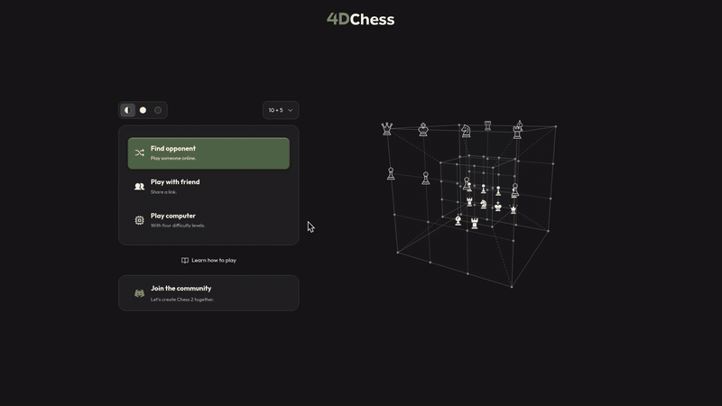

  

  Galaxy brain chess

  
  

  

  <a href="https://4dchess.lol/how-to-play">Learn to play</a> ·
  <a href="CONTRIBUTING.md">Contribute</a> ·
  <a href="docs/development.md">Development</a> ·
  <a href="docs/credits.md">Credits</a>

  <a href="LICENSE">MIT</a> © 0xmiki

