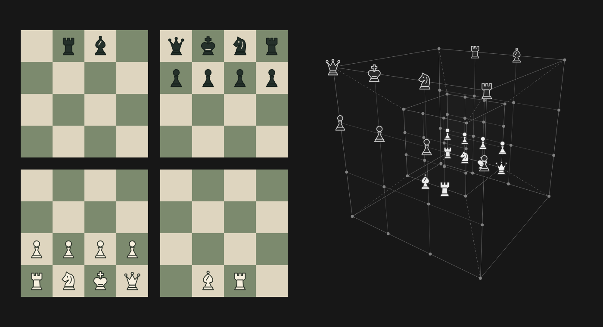

<p align="center">
  
</p>

<p align="center">
  A new way to play chess.
</p>

<p align="center">
  <a href="https://4dchess.lol"></a>
  <a href="LICENSE"></a>
  <a href="https://discord.gg/3hxrqHPfxE"></a>
</p>



Four connected boards, one game. Move across all four dimensions and see the same position in a rotatable tesseract.

## What it does

- Play a friend through an invitation link. No signup form, just a guest name and a seat.
- Find an online opponent in unrated matchmaking with 3+2, 5+3, or 10+5 clocks.
- Request a rematch, swap colors, and keep score in the same room.
- Play the computer at four difficulty levels. Games run locally and can be resumed later.
- Learn through interactive lessons, or place pieces anywhere in free practice.
- Inspect attacks on either side, review previous moves, and export a game as 4D PGN.
- Use a mouse, keyboard, or touch screen. Both board views stay in sync.

Friend challenges support timed and untimed games. Computer play remains untimed. Registered accounts, ratings, and spectators are not implemented.

## Controls

| Action                  | Control                                             |
| ----------------------- | --------------------------------------------------- |
| Move a piece            | Select it, then select a marked destination         |
| Inspect attacks         | Right-click a square, or long-press on touch        |
| Clear inspection        | Left-click or tap the board                         |
| Rotate the tesseract    | Drag it, or use arrow keys while focused            |
| Reset its viewing angle | Press Home while the tesseract is focused           |
| Review a position       | Select a move in the history; select Live to return |

## Develop

Requires [Bun](https://bun.sh) and a [Convex](https://convex.dev) project for multiplayer.

```sh
bun install
bunx convex dev --once  # create or select your own development project
```

Follow the one-time [environment setup](docs/development.md), then start the app:

```sh
bun run dev:all
```

The app opens at `http://localhost:5173`. Computer play and lessons run in the browser; friend games use your configured backend.

```sh
bun run test:rules
bun run test:backend
bun run check
bun run lint
bun run build
```

See [development](docs/development.md) for the full setup and browser tests, and [deployment](docs/deployment.md) for Cloudflare and GitHub Actions.

## Contributing

Bug reports and pull requests are welcome. Include the steps to reproduce an issue and the board position or exported game when relevant. [CONTRIBUTING.md](CONTRIBUTING.md) explains the project layout and checks.

## Credits

Built with [SvelteKit](https://svelte.dev/docs/kit), [Convex](https://convex.dev), and [Better Auth](https://better-auth.com). Interface icons are from [Phosphor](https://phosphoricons.com), distributed under the MIT license. The social preview uses [TeX Gyre Pagella](https://www.gust.org.pl/projects/e-foundry/tex-gyre/pagella), distributed under the GUST Font License.

The rules, piece artwork, and tesseract view grew out of the original Fourfold prototype. The [rules reference](src/lib/chess/README.md) describes this variant's movement and outcomes.

## License

[MIT](LICENSE) © 0xmiki. Dependencies retain their respective licenses.
