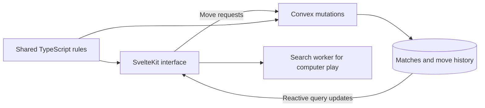

# Multiplayer 4D chess architecture

This document records the architecture for the first release: untimed friend matches joined as guests through invite links. SvelteKit provides the frontend. Convex owns authentication checks, match state, move validation, persistence, and subscriptions.

The existing prototype at `prototype/index.html` supplies the rules, board interactions, and computer search. This document describes the intended implementation, not functionality already built.

## First release

The primary flow is:

```text
Create match
→ guest session exists
→ participant exists
→ creator claims a white or black seat
→ invitation is created

Friend opens invitation
→ sees a limited match preview
→ presses Join
→ transaction claims the remaining seat
→ match becomes active

Play
→ both participants subscribe to the match
→ server validates and commits each move
→ refresh restores identity and seat
→ disconnect does not alter the match

End
→ checkmate, automatic draw, or resignation
→ status becomes finished
→ result is stored
```

Opening an invitation does not claim a seat. This also prevents link previews from joining games.

The first release has no chess clocks. Active matches do not expire because someone disconnects. Waiting matches expire after 24 hours.

Accounts, matchmaking, ratings, spectators, draw offers, takebacks, and rematches are later discussions. The multiplayer policy for the prototype's threat previews and other assistance remains to be decided.

## System boundaries



The browser calculates legal destinations for immediate feedback. Convex independently validates every multiplayer move against the stored position. A browser never submits an authoritative board, result, player identity, or timestamp.

The frontend subscribes directly to Convex using `convex-svelte`. SvelteKit provides routes and any authentication integration required by the chosen provider. Match mutations live in Convex.

Camera position, selected squares, animations, and threat inspection stay local. Computer search remains separate from authoritative multiplayer validation.

## Rules engine

Extract `createRules()` from the prototype into pure TypeScript under `src/lib/chess/`. Keep browser storage, rendering, and search outside this module.

The initial ruleset preserves the prototype:

- The board has dimensions `4 × 4 × 2 × 2`, with 64 squares and ten pieces per side.
- White moves first.
- Pawns automatically promote to queens.
- There is no castling, en passant, or opening pawn double move.
- A move cannot leave the moving side's king in check. Kings are never captured.
- Checkmate wins the game.
- Stalemate, third repetition, 100 halfmoves without a pawn move or capture, and bare kings automatically draw the game.

Preserve the prototype's movement definitions and outcome precedence. Tests must cover movement across dimensions, blocking, king safety, promotion, repetition, and terminal positions.

Each match stores a `rulesVersion`, initially `fourfold-v1`. Ongoing games and replays use their original version. A future rule change must not silently change an existing game.

The shared engine exposes position creation, move validation, move application, position keys, and outcome calculation. Given the same rules version, position, draw state, and move, it must return the same result.

## Participants and authentication

Matches reference stable participant IDs:

```ts
whiteParticipantId: ParticipantId | null;
blackParticipantId: ParticipantId | null;
```

A guest participant initially has:

```ts
{ guestId: "...", userId: null }
```

Creating an account can change its identity binding while retaining the participant ID:

```ts
{ guestId: null, userId: "..." }
```

Exactly one identity binding is active. Match seats and move history continue referencing the same participant ID.

Guests still have authenticated sessions. Convex resolves the caller's participant from a verified session, never from a participant ID supplied as proof of identity. Concurrent requests to establish the same participant must resolve to one record.

Refreshing restores access while that guest session remains valid. Losing an unlinked guest session means losing access to its seat in the initial release. The invitation cannot be used to impersonate an existing participant or recover a consumed seat.

The authentication provider is not yet selected. Better Auth with anonymous authentication and the documented Convex SvelteKit integration is the first candidate to evaluate.

Later account linking must also handle signing into an account that already has a participant. An alias between participants is a possible approach, but ownership conflicts require a policy before implementation. Account linking must preserve existing seat access without rewriting matches.

## Match lifecycle and result

```text
waiting → active → finished
waiting → finished · cancellation
```

Lifecycle and ending are separate fields:

```ts
type MatchStatus = 'waiting' | 'active' | 'finished';

type MatchResult =
	| {
			reason: 'checkmate' | 'resignation';
			winner: 'white' | 'black';
	  }
	| {
			reason: 'draw';
			winner: null;
			detail: 'stalemate' | 'repetition' | 'fiftyMove' | 'bareKings';
	  }
	| {
			reason: 'cancellation';
			winner: null;
			detail: 'creatorCancelled' | 'inviteExpired';
	  };

type MatchEnding = {
	status: MatchStatus;
	result: MatchResult | null;
	finishedAt: number | null;
};
```

The `detail` fields are a proposed refinement for history and explanations. The agreed result categories are checkmate, draw, resignation, and cancellation.

Invariants:

- Waiting matches have exactly one occupied seat.
- Active matches have two distinct participants.
- Waiting and active matches have no result or finish timestamp.
- Finished matches have a result and finish timestamp.
- Cancellation ends a waiting match. Resignation ends an active match and awards the win to the other side.
- Finishing writes status, result, and finish timestamp atomically.
- Finished matches accept no further moves or changes to their result.

## Stored records

| Table          | Contents                                                                                                                                 |
| -------------- | ---------------------------------------------------------------------------------------------------------------------------------------- |
| `participants` | Stable participant ID, display name, and authentication identity binding.                                                                |
| `games`        | Creator, seats, status, rules version, current board, side to move, revision, ply, draw state, waiting deadline, result, and timestamps. |
| `moves`        | Game ID, ply, participant ID, source and destination, request ID, accepted revision, and server timestamp.                               |
| `invites`      | Game ID, invitation token hash, deadline, and consumption or revocation state.                                                           |

Authentication session records belong to the selected authentication integration.

Store the current position in `games` so opening a match does not require replaying its history. Store accepted moves separately and paginate history. Commit the updated position and its move record in the same transaction.

The current draw state includes the halfmove counter and position keys since the most recent pawn move or capture, including the current position. Under this ruleset, the automatic 100-halfmove draw bounds that window. Include the initial position when starting repetition tracking.

Use indexes for identity lookup, invitation token lookup, moves by game and ply, and accepted requests by game, participant, and request ID. Enforce uniqueness through transactional checks; an index alone is not a uniqueness constraint.

## Revisions and retries

Every match starts with `revision: 0`. Every accepted move increments it.

The proposed convention is to increment revision for every accepted change to shared match state, including joining, resignation, and cancellation. Keep `ply` separately as the number of moves played. Rejected requests and successful retries increment neither field.

A move request contains:

```ts
{
  gameId,
  move: { from, to },
  expectedRevision: 14,
  requestId: "..."
}
```

The client generates one request ID per intended move and retains it for retries. Request IDs are scoped to the game and authenticated participant. Reusing one with different contents is an error.

A stale request is rejected with `STALE_REVISION`. If the same request already succeeded, return its original receipt before checking whether its expected revision is now stale. This handles a committed move whose acknowledgement was lost.

## Transaction contracts

### Create

Resolve the authenticated guest participant, reserve the creator's chosen seat, initialize the position and rules version, and create a 24-hour invitation. Use a cryptographically random invitation token and store its hash. The default color selection remains a product decision.

Creation should also tolerate retries without creating multiple matches. The exact creation receipt and secure invitation recovery mechanism will be defined with the authentication implementation.

### Join

Joining runs in one Convex mutation:

1. Resolve the authenticated participant and target match.
2. If the participant already occupies a seat, return that seat successfully.
3. If both seats are occupied, return `MATCH_FULL`.
4. Verify that the invitation is valid, unconsumed, and unexpired, and that the match is waiting.
5. Claim the remaining seat, consume the invitation, and activate the match atomically.

Existing membership is checked before invitation consumption or expiry. A successful joiner's retry restores their seat even after their original join consumed the invitation.

If three distinct participants attempt to join concurrently, exactly one claims the remaining seat. The others receive `MATCH_FULL`. The creator's repeated join returns their existing seat rather than claiming the second one.

### Submit move

One mutation performs the complete transition:

1. Resolve the caller and verify match membership.
2. Check for an already accepted request and validate that its contents match.
3. Check active status, expected revision, and whose turn it is.
4. Validate input bounds and move legality using the stored rules version.
5. Apply the move and update draw state.
6. Calculate the resulting outcome.
7. Atomically insert the move and update the position, side to move, ply, revision, and any ending.

No validation decision relies on a browser-supplied board or result. Concurrent moves or a move racing resignation must serialize through the same game record.

### Cancel and resign

Only the creator can cancel a waiting match. Either seated participant can resign an active match. Validate caller, status, and revision in the transaction. Repeated requests must not produce a second ending or increment revision again.

## Expiry and retention

Creation stores the waiting deadline and schedules an internal expiry mutation. Joining also checks the deadline directly, so a delayed scheduled job cannot admit a participant after expiry.

The expiry mutation cancels only a match that is still waiting and whose deadline has passed. If the match has become active, it does nothing. Expiry and joining use the same game record so competing transitions cannot both succeed.

Expiration invalidates an invitation; it does not delete its records. A separate proposed retention policy deletes expired, never-started games, their invitations, and related temporary records after seven days. This retention period is not yet agreed. Completed played games remain available for history.

## Queries and reconnection

An invitation preview returns only the information needed to decide whether to join. Full match and history queries require membership in the first release. Invitation tokens and private authentication data must not appear in match responses.

Both players subscribe to the same authoritative match. Refresh restores the session, resolves the participant, and loads the existing seat. It does not require claiming a seat again.

After reconnection, reconcile the latest revision and any pending request receipt. The UI distinguishes an unconfirmed move from an accepted one and replaces stale local state with the server position.

A disconnect has no lifecycle effect. Presence is not proof of forfeiture. Any future presence updates should remain separate from the game record and its revision.

## Implementation order and verification

1. Extract the rules engine and test parity with the prototype.
2. Implement guest identity, schema, invitation creation, and transactional joining.
3. Implement authoritative moves, results, cancellation, resignation, and waiting expiry.
4. Connect the existing board interactions to SvelteKit and Convex subscriptions.
5. Verify complete games in two independent browser sessions.

Backend checks must exercise concurrent joins, duplicate requests, stale revisions, unauthorized moves, move/resignation races, join/expiry races, and attempts to change finished games. Reconnection checks must include a move accepted before the client receives its acknowledgement.

Benchmark move validation in the deployed Convex runtime before release. Keep computer search outside move mutations.

## Technical references

- [Convex Svelte integration](https://docs.convex.dev/client/svelte/overview)
- [Convex transactions and concurrency](https://docs.convex.dev/database/advanced/occ)
- [Convex scheduled functions](https://docs.convex.dev/scheduling/scheduled-functions)
- [Convex execution and storage limits](https://docs.convex.dev/production/state/limits)
- [Convex Svelte authentication](https://docs.convex.dev/client/svelte/authentication)
- [Convex Better Auth SvelteKit integration](https://labs.convex.dev/better-auth/framework-guides/sveltekit)
- [Better Auth anonymous authentication](https://better-auth.com/docs/plugins/anonymous)
