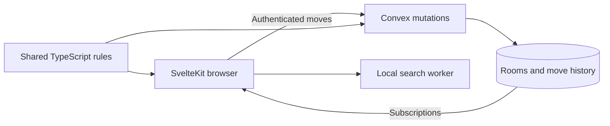

# Architecture

SvelteKit renders the app. Convex owns guest identity, friend rooms, move validation, and persistence. The browser owns presentation, lessons, and computer search.

## Rules and presentation

The `fourfold-v1` ruleset defines a `4 × 4 × 2 × 2` board. Pure TypeScript functions validate movement, king safety, promotion, and automatic outcomes. The client highlights possible moves; the server independently validates submitted moves.

The four flat boards and tesseract render the same position. Selection, camera rotation, threat annotations, and animation never change the authoritative state. Multiplayer moves appear optimistically and reconcile with the server's receipt. Historical review uses a separate board and disables moves until the player returns to Live.

## Identity and rooms

Better Auth creates an anonymous account when someone creates or accepts a challenge. Names are generated at account creation and copied into stable participant records. Invitation previews expose only the details needed to accept; room and move queries require membership.

A room's first game is its stable anchor. Subsequent rounds point back to it, and the anchor points to the current round. Acceptance of a rematch starts a fresh game with swapped seats. Scores follow participants rather than colors, and previous move histories remain intact.

Invitation tokens use the URL fragment so they are not sent in ordinary HTTP requests. The backend derives tokens using HMAC and stores their hashes. Pending challenges expire after 24 hours. Deletion is restricted to the creator before the game begins.

## Reliable commands

Move and resignation requests carry a request ID and expected revision. The server checks stored receipts before validating a new command. Retrying an accepted command returns its original result, including after another move or the end of a game.

The browser saves pending move requests in session storage. A reload can retry the same command without duplicating it. Invalid moves roll back; uncertain network outcomes remain retryable. An active friend game must be resigned before leaving through the interface.

## Local modes

Computer games and lessons do not create backend games or guest sessions. Search runs in a Web Worker. Computer history is stored locally and replayed through the rules engine when restored. Players can leave and resume without resigning.

Free practice permits either color to move without turn or king-safety restrictions, and supports placing pieces, undoing edits, and resetting the position.

## Deployment

Cloudflare Workers serves the SvelteKit app and proxies authentication. A shared secret authenticates anonymous-signup requests between the Worker and Convex. Rate limits and expiry cleanup are described in [operations.md](docs/operations.md). Deployment instructions are in [deployment.md](docs/deployment.md).
